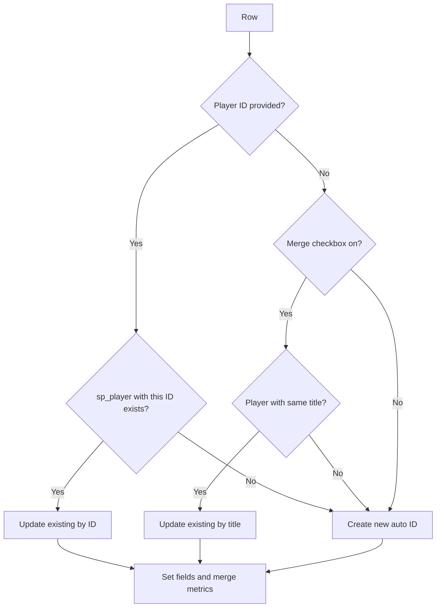

# Enhanced Import for SportsPress — Architecture

This document captures how the **Enhanced Import for SportsPress** plugin works and how
it extends the SportsPress CSV import tools. It is meant as a reference so the analysis
does not need to be repeated, and as a blueprint for adding new enhanced importers
(e.g. an enhanced "Import Players").

- Plugin folder: `wp-content/plugins/enhanced-import-fixtures-for-sportspress/`
- Internal slug / text domain: `enhanced-import-for-sportspress`
- Depends on: **SportsPress** (free or Pro) being active.

---

## 1. File layout

| File | Role |
|------|------|
| `enhanced-import-for-sportspress.php` | Bootstrap / entry point: constants, activation guard, helper functions. |
| `includes/class-eifs-plugin.php` | Coordinator: hooks into the SportsPress importers registry (fixtures + players). |
| `includes/class-eifs-fixture-importer.php` | The enhanced fixture importer logic (`extends SP_Importer`). |
| `includes/class-eifs-player-importer.php` | The enhanced player importer logic (`extends SP_Importer`). |
| `dummy-data/fixtures-sample.csv` | Sample fixtures CSV offered for download on the import screen. |
| `dummy-data/players-sample.csv` | Sample players CSV offered for download on the import screen. |
| `readme.txt` | WordPress.org-style readme. |

---

## 2. How SportsPress exposes its importers

SportsPress registers every CSV importer through the `sportspress_importers` filter in
`SP_Admin_Importers::register_importers()`
(`wp-content/plugins/SportsPress/includes/admin/class-sp-admin-importers.php`).

Each importer is an array entry keyed by an id, with `name`, `description`, and `callback`:

```php
$importers = apply_filters( 'sportspress_importers', array(
    'sp_event_csv'   => array( 'name' => ..., 'description' => ..., 'callback' => array( $this, 'events_importer' ) ),
    'sp_fixture_csv' => array( 'name' => ..., 'description' => ..., 'callback' => array( $this, 'fixtures_importer' ) ),
    'sp_team_csv'    => array( 'name' => ..., 'description' => ..., 'callback' => array( $this, 'teams_importer' ) ),
    'sp_player_csv'  => array( 'name' => ..., 'description' => ..., 'callback' => array( $this, 'players_importer' ) ),
    'sp_staff_csv'   => array( 'name' => ..., 'description' => ..., 'callback' => array( $this, 'staff_importer' ) ),
) );

foreach ( $importers as $id => $importer ) {
    register_importer( $id, $importer['name'], $importer['description'], $importer['callback'] );
}
```

Relevant importer ids:

- `sp_event_csv` — Events
- `sp_fixture_csv` — Fixtures (enhanced by this plugin)
- `sp_team_csv` — Teams
- `sp_player_csv` — Players
- `sp_staff_csv` — Staff
- `sp_event_performance_csv` — Box Score (only outside `import.php`)

Each default callback (`SP_Admin_Importers::fixtures_importer()`, `players_importer()`, etc.)
calls `self::includes()` (which loads `SP_Importer` base class), then `require`s the matching
`importers/class-sp-*-importer.php` file and runs `$importer->dispatch()`.

---

## 3. Integration strategy (the core trick)

The plugin **does not modify any SportsPress core file**. Instead it intercepts the
`sportspress_importers` filter and swaps only the `callback` (and `name`) of the importer
it wants to enhance.

### Bootstrap (`enhanced-import-for-sportspress.php`)

- Defines constants: `EIFS_PLUGIN_BASE`, `EIFS_PLUGIN_DIR`, `EIFS_PLUGIN_URL`.
- On `plugins_loaded` with priority `PHP_INT_MAX` (so SportsPress is guaranteed loaded
  first), checks `eifs_is_sportspress_active()` and, if true, instantiates `EIFS_Plugin`.
- `eifs_is_sportspress_active()` looks for `SportsPress` class, `SP()` function,
  `SP_Importer`, or `SportsPress_Pro`.
- Provides `eifs_get_post_by_title( $title, $post_types, $post_status = 'publish' )`, a
  safe `WP_Query` exact-title lookup that replaces the deprecated `get_page_by_title()`.

### Coordinator (`includes/class-eifs-plugin.php` — `EIFS_Plugin`)

- Constructor adds `add_filter( 'sportspress_importers', ..., 99 )` (priority 99 so it runs
  after SportsPress has populated the array).
- `eifs_replace_importer_callbacks()` replaces:
  - `sp_fixture_csv`: `callback` → `eifs_fixtures_importer`, `name` → `Import Fixtures (CSV) Enhanced`.
  - `sp_player_csv`: `callback` → `eifs_players_importer`, `name` → `Import Players (CSV) Enhanced`.
- `eifs_fixtures_importer()` / `eifs_players_importer()`:
  1. `load_sportspress_importer_classes()` — ensures the WP Importer API and the
     `SP_Importer` base class are loaded the same way SportsPress does (via
     `SP_Admin_Importers::includes()`), **without hardcoding paths**.
  2. `require_once` the matching enhanced importer class file.
  3. `new EIFS_Fixture_Importer()` / `new EIFS_Player_Importer()` then `->dispatch()`.

> To add a new enhanced importer, repeat this pattern for the corresponding id
> (e.g. swap `$importers['sp_team_csv']['callback']`).

---

## 4. The `SP_Importer` base class (inherited behaviour)

`wp-content/plugins/SportsPress/includes/admin/importers/class-sp-importer.php`
implements the shared 3-step CSV workflow in `dispatch()`:

- **Step 0 — `greet()`**: shows the upload form (`wp_import_upload_form`).
- **Step 1 — `table( $file )`**: parses the CSV header, renders a preview table with a
  `dropdown()` per column for column mapping, driven by `$this->columns` and
  `$this->optionals`. Also renders `options()` above the table.
- **Step 2 — `import( $array, $columns )`**: performs the actual insert/update. Receives
  the flattened `$_POST['sp_import']` array and the selected column keys.

Key inherited members a subclass relies on / overrides:

- Properties: `$import_page`, `$import_label`, `$columns`, `$optionals`, `$imported`, `$skipped`, `$delimiter`.
- The base nonce protecting steps 1 & 2 is `import-upload` (`check_admin_referer`).
- `import()` chunks the flat POST array with `array_chunk( $array, count( $columns ) )`.

A subclass typically overrides: `__construct()` (defines columns/labels), `import()`,
`greet()`, `options()`, and adds its own `import_end()`.

---

## 5. The enhanced fixture importer (`EIFS_Fixture_Importer`)

`includes/class-eifs-fixture-importer.php`, `extends SP_Importer`. What it adds **over the
stock `SP_Fixture_Importer`**:

### a) Extra CSV columns — scores
Stock fixture columns: `post_date, post_time, sp_venue, sp_home, sp_away, sp_day`.
Enhanced adds `sp_home_score` and `sp_away_score`:

```php
$this->columns = array(
    'post_date'     => 'Date',
    'post_time'     => 'Time',
    'sp_venue'      => 'Venue',
    'sp_home'       => 'Home',
    'sp_away'       => 'Away',
    'sp_home_score' => 'Home Score', // NEW
    'sp_away_score' => 'Away Score', // NEW
    'sp_day'        => 'Match Day',
);
$this->optionals = array( 'sp_home_score', 'sp_away_score', 'sp_day' );
```

### b) Results processing
After both teams are attached to the event, if both scores are present it writes the match
result with the native SportsPress function:

```php
$results = array();
$results[ $teams[0] ] = $home_score; // home
$results[ $teams[1] ] = $away_score; // away
sp_update_main_results( $id, $results );
```

This drives SportsPress' native outcome calculation.

### c) Auto-create League Table (`sp_table`) and Calendar (`sp_calendar`)
Controlled by two new UI radio options (`eifs_auto_create_league_table`,
`eifs_auto_create_calendar`). After the loop:

- Resolves the selected league/season slugs to `term_id` via `get_term_by( 'slug', ... )`.
- For the calendar: checks (via `tax_query` on league + season) whether one already exists
  to avoid duplicates; otherwise creates one titled `"<League> <Season>"`, assigns the
  league/season terms, and sets `sp_format = list`.
- For the table: same duplicate guard; otherwise creates `sp_table` titled `"<League> <Season>"`,
  assigns league/season terms, attaches the (deduplicated) imported team ids, sets
  `sp_select = manual`, and assigns **all** published `sp_column` posts to `sp_columns`.

### d) Team id accumulation
`public $teams_ids = array();` collects every team id created/used during import, then
`array_unique()` is used to populate the auto-created league table.

### e) Security hardening
Adds a dedicated nonce on top of the base `import-upload` nonce:
`wp_nonce_field( 'eifs_import', 'eifs_nonce' )` in `options()`, verified at the top of
`import()`. Inputs are read with `sanitize_text_field( wp_unslash( ... ) )`,
`sanitize_key()`, etc.

### f) UI / messaging
- `options()` adds: Format (Competitive/Friendly), League dropdown, Season dropdown,
  Date Format, plus the two auto-create radios.
- `greet()` mirrors the stock greeting and links to `dummy-data/fixtures-sample.csv`.
- After import, prints an "imported/skipped" summary plus dismissible notices with edit
  links to any auto-created table and calendar.
- `import_end()` fires the custom action `eifs_import_end` (stock uses `import_end`).

### Date handling
Same as stock: normalises `/` to `-`, splits, and reformats according to the
`sp_date_format` option (`yyyy/mm/dd`, `dd/mm/yyyy`, `mm/dd/yyyy`). Time, if present, is
appended to the date.

---

## 6. SportsPress data model touched by importers

- **Post types**: `sp_event`, `sp_team`, `sp_player`, `sp_calendar`, `sp_table`, `sp_column`.
- **Taxonomies**: `sp_league`, `sp_season`, `sp_venue`, `sp_position`.
- **Common meta**: `_sp_import` (flag for imported posts), `sp_format`, `sp_day`,
  `sp_team` (multi), `sp_columns`, `sp_select`.
- **Helpers**: `sp_array_value()`, `sp_update_main_results()`, `sp_get_the_term_id()`,
  `sp_get_post_by_title()`, `sp_dropdown_taxonomies()`, `sp_taxonomy_adder()`.

---

## 7. The enhanced player importer (`EIFS_Player_Importer`)

`includes/class-eifs-player-importer.php`, `extends SP_Importer`. Based on the stock
`SP_Player_Importer`
(`wp-content/plugins/SportsPress/includes/admin/importers/class-sp-player-importer.php`).

### Stock player importer recap
- Columns (8): `sp_number` (Squad Number), `post_title` (Name), `sp_position` (Positions),
  `sp_team` (Teams), `sp_league` (Leagues), `sp_season` (Seasons), `sp_nationality`
  (Nationality), `post_date` (Date of Birth).
- Multi-value fields use the `|` delimiter (positions, teams, leagues, seasons).
- **Merge duplicates** option (`merge`): if a player with the same title exists, update it
  instead of creating a new one, preserving existing `sp_league`, `sp_position`, `sp_season`
  terms (`$preservable_metas_keys`).
- First team → `sp_current_team`; remaining teams → `sp_past_team` (and all → `sp_team`).
- `sp_nationality` stored lowercased; `*` means cleared.

### What the enhanced version adds

**a) Player ID column (update-by-ID)**
A leading optional `sp_player_id` column. Resolution order per row:
1. If a numeric Player ID is given and a `sp_player` post with that ID exists → **update**
   that player (publishing it if needed). If a name is also given, its title is updated.
2. Otherwise fall back to the native behaviour: if **Merge duplicates** is on, look up by
   title and update; otherwise create a new player.
3. If a Player ID is given but no matching player exists, a new player is created with an
   **auto-generated** WordPress ID (the CSV ID is ignored on creation).



**b) Dynamic metric columns**
`append_metric_columns()` queries every published `sp_metric` post and appends one column
per metric (key `sp_metric_<slug>`, label = metric title). On import, values are written
into the player's `sp_metrics` meta array (`slug => value`). Existing `sp_metrics` are read
first and **only overwritten for metric columns that have a non-empty value** — blank
metric cells preserve the current value (important for updates).

**c) Security / consistency**
- Dedicated nonce `eifs_nonce` / action `eifs_player_import` (on top of the base
  `import-upload` nonce), verified at the top of `import()`.
- Title/team lookups use the `eifs_get_post_by_title()` helper across all post statuses.
- Preservable terms (`sp_league`, `sp_position`, `sp_season`) are appended on any update
  (by ID or by title), mirroring stock merge behaviour.
- `import_end()` fires the shared `eifs_import_end` action.

> Note: the folder is named `...-fixtures-...` but the code is written generically
> ("for SportsPress"), so player support lives in the same plugin.

---

## 8. Hooks reference

| Hook | Type | Where | Purpose |
|------|------|-------|---------|
| `sportspress_importers` | filter | SportsPress core | Registry of importers; the plugin swaps the fixture and player callbacks here. |
| `plugins_loaded` (PHP_INT_MAX) | action | Bootstrap | Late init so SportsPress is loaded first. |
| `eifs_import_end` | action | `EIFS_Fixture_Importer::import_end()` / `EIFS_Player_Importer::import_end()` | Custom post-import extension point. |
